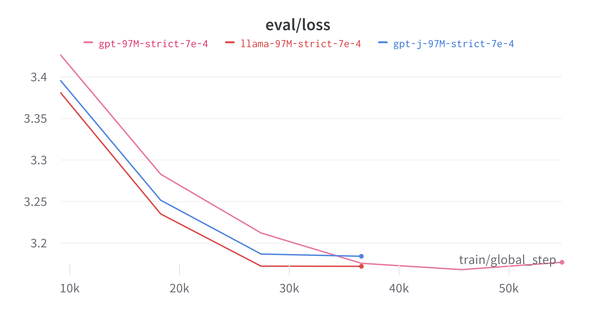

# BabyLlama


*BabyLlama and its teachers, as depicted by  DALL·E 3.*

Very basic training code for BabyLlama, our submission to the strict-small track of the BabyLM challenge. See our [paper](https://arxiv.org/abs/2308.02019) for more details.

We perform some basic regex-based cleaning of the dataset and then train a tokenizer on the cleaned dataset. This is performed in `cleaning_and_tokenization.ipynb`. The notebook assumes that the babylm dataset (`/babylm_10M` and `/babylm_dev`) is placed or symlinked in the `/data` folder.
The tokenizer is saved in '/models' folder. We use the same tokenizer for both teacher and student models.

To train the teacher models: 
```
python train.py --config ./config/gpt-705M.yaml
```
And analogously for `llama-360M.yaml`.
One can also rewrite the learning rate and the model name defined in the config by adding arguments `--lr` and `--model_name` respectively. The trained model is saved in the `/models` folder.
Once the two teacher models are trained, run `distill-ensemble-pretraining-baby-llama.py` to train the student model using the distillation loss. 
We modified the Trainer from this [repository](https://github.com/philschmid/knowledge-distillation-transformers-pytorch-sagemaker). Notice that it is not optimized to run on multiple GPUs (teachers are placed on a single GPU).
With the current settings (model sizes and batch sizes) everything fits on a single 20GB GPU.


## Llama training speed

During our tests, we found that Llama trains significantly faster than GPT-2. It reaches the minimum eval loss in nearly half the number of epochs needed for GPT-2. There are two main differences between the models: GPT uses trainable positional embeddings, while Llama employs Rotary Positional Embedding (RoPE); additionally, Llama utilizes SwiGLU instead of simple MLP layers. 

To try to isolate these two effects, we also trained GPT-J, which uses RoPE (although we used the default settings and didn't attempt to make the RoPE implementations match precisely) but not SwiGLU. To make the comparison with GPT-2 more accurate, we enabled weight tying in both Llama and GPT-J (this feature is disabled by default). We performed a grid search for the optimal learning rate (happened to be the same for all three models) using the 10M BabyLM dataset (strict-small task). Then trained all the models using the 100M dataset (strict task; see the configs *-strict.yaml). The result is shown below.



Llama achieves a lower loss than GPT-J and does so more quickly than GPT-2. It seems that SwiGLU -— a gated unit that is quadratic in its inputs -— performs better.